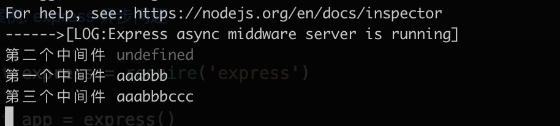
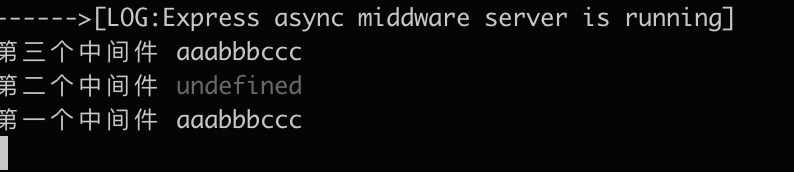

# Expres-Or-Koa

本库记录 express 和 koa 的异同,以及一些需要注意的问题

## 架构区别

- `express`是完整和强大的, 其中内置了非常多的功能
- `koa`简洁内置功能较少, 只包含核心功能, 需要借助外部中间件来完成功能

## 中间件

`express` 和 `koa`核心都是中间件, 它们的中间件底层实现不同, 所以执行机制也有区别

- `express`对异步中间件支持不好

- `koa`对同步和异步中间件均支持度较好

可以参考本库案例来理解中间件执行核心逻辑, 以及如何解决 express 中异步中间件执行顺序的问题

## 征对 express 异步的补丁

由于`express`对异步支持有些小问题, 所以笔者把`express`的源码理了一遍后, 通过以下案例进行测试整理

- [案例: express 异步问题](./express-async-middware.js)

```js
const express = require('express')

const app = express()

/**
 * 需求: 在第一个中间件返回响应aaabbbccc
 * 全是同步中间件时候, 很容易实现aaabbbccc
 * 只要有异步中间件就会出现问题, 下面代码只能返回aaabbb
 *
 * 征对异步中间件出现的问题:
 * - 只能将异步的中间件拆分成普通函数, 通过await asyncFn来执行
 * - 如果不强制要求在第一个中间件返回, 可以在最后的异步中间件返回结果
 */
app.use(async (req, res, next) => {
  req.message = 'aaa'
  await next()
  /* 解决异步中间件问题 */
  // await asyncFn(req, res)
  console.log('第一个中间件', req.message)
  res.end(`express-async-middware: ${req.message}`)
})

app.use(async (req, res, next) => {
  req.message += 'bbb'
  // 最后一个中间件调用next, 会默认抛出错误给客户端
  await next()
  console.log('第二个中间件', res.message)
})

/* 异步中间件会出现执行顺序的问题 */
app.use(async (req, res, next) => {
  // res.message += 'ccc' // 同步正常返回
  await new Promise((rs) => {
    setTimeout(() => {
      req.message += 'ccc'
      rs()
    }, 2000)
  })
  console.log('第三个中间件', req.message)
})

/* express中将异步中间件提取出来, 作为普通异步函数执行来解决 */
/* const asyncFn = (req, res) => {
  return new Promise((rs) => {
    setTimeout(() => {
      req.message += 'ccc'
      rs()
    }, 2000)
  })
} */

app.listen(8088, () => {
  console.log(
    '%c------>[LOG:Express async middware server is running]',
    'color: fuchsia'
  )
})
```

征对上述的案例, `express`源码中主要未对 `next` 的结果进行返回处理, 导致`await`后面是 undefined, 所以无法进行异步处理

**下面对源码打补丁, 仅提供一个支持异步中间件打补丁的方向, 未对边界和其他情况下进行 `hack` 处理**

针对源码进行的修改, 本文使用的是express@4.18.2版本

- express@4.18.2/node_modules/express/lib/router/index.js

```js
proto.handle = function handle(req, res, out) {
  function next(err) {
    // ... 其余省略, 该行增加return
    return self.process_params(layer, paramcalled, req, res, function (err) {
      if (err) {
        next(layerError || err)
      } else if (route) {
        layer.handle_request(req, res, next)
      } else {
        // 增加return
        return trim_prefix(layer, layerError, layerPath, path)
      }

      sync = 0
    })
  }

  function trim_prefix(layer, layerError, layerPath, path) {
    // ... 其余省略
    if (layerError) {
      layer.handle_error(layerError, req, res, next)
    } else {
      // 增加return
      return layer.handle_request(req, res, next)
    }
  }
}
```

- express@4.18.2/node_modules/express/lib/router/route.js

```js
Layer.prototype.handle_request = function handle(req, res, next) {
  var fn = this.handle

  if (fn.length > 3) {
    // not a standard request handler
    return next()
  }

  try {
    // 增加return
    return fn(req, res, next)
  } catch (err) {
    next(err)
  }
}
```

上面案例的最终结果如图:

- 补丁前



- 补丁后



